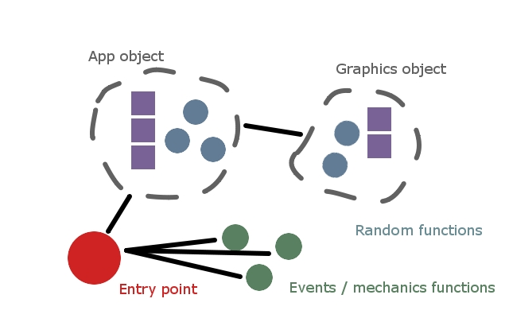

# Bartelby

"Bartelby" is a basic migration of the engine architecture towards reusable
models and behavior. In "Bartelby", two objects are introduced:

1. An "App" object that defines the top-level singleton and state

1. A "Graphics" object that handles GL calls and related information

Beyond these two objects, a modest degree of custom coding is still required to
tie it all together, and most application content and behavior is still
hard-coded. Nonetheless, this represents considerable streamlining and points
the way towards a much more flexible and reusable architecture in subsequent
iterations.



Bartelby exists halfway between the open-ended global free-for-all of Alphonse
and subsequent iterations--there is still considerable freedom to experiment
with many different approaches but with the beginnings of a real structure that
can be used across multiple projects.

To learn more about our journey through engine architecting, you can read the
original dev.to article here:

    https://dev.to/tythos/engines-evolution-10gk

The MSVC solution in the "msvc/" folder is the easiest way to build this
project. You could also build the *.cpp* files from the command line, if you so
desire (or are using a different IDE/compiler). Either way, you will need the
following artifacts at runtime:

* "basic.f.glsl" and "basic.v.glsl" shader source, assumed to exist one folder
  above the runtime directory.

* Dynamic libraries for GLEW and SDL2 (e.g., "glew32d.dll" and "SDL2.dll"),
  assumed to exist within the runtime directory.

Building (with or without the MSVC solution) will require source headers for
GLEW and SDL projects. You will also need static libraries to link against for
both GLEW and SDL projects, as well.

## Building

As of 2023/08/21, this project supports building via cmake with dependencies
hooked via submodule. This makes it fairly easy to get up and running from a
fresh clone:

```
> git submodule update --init --recursive
> cmake -S . -B build
> cmake --build build
```

Once you have copied runtime artifacts (SDL3.dll and the .GLSL shaders) into
the "build/Debug" folder, you should be good to go.
