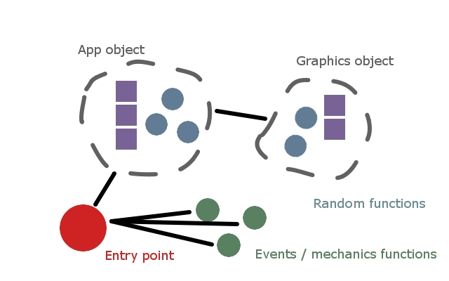

Bartelby
========

"Bartelby" is a basic migration of the engine architecture towards reusable
models and behavior. In "Bartelby", two objects are introduced:

#. An "App" object that defines the top-level singleton and state

#. A "Graphics" object that handles GL calls and related information

Beyond these two objects, a modest degree of custom coding is still required to
tie it all together, and most application content and behavior is still
hard-coded. Nonetheless, this represents considerable streamlining and points
the way towards a much more flexible and reusable architecture in subsequent
iterations.

Bartelby exists halfway between the open-ended global free-for-all of Alphonse
and subsequent iterations--there is still considerable freedom to experiment
with many different approaches but with the beginnings of a real structure that
can be used across multiple projects.

To learn more about our journey through engine architecting, you can read the
original dev.to article here:

    https://dev.to/tythos/engines-evolution-10gk
